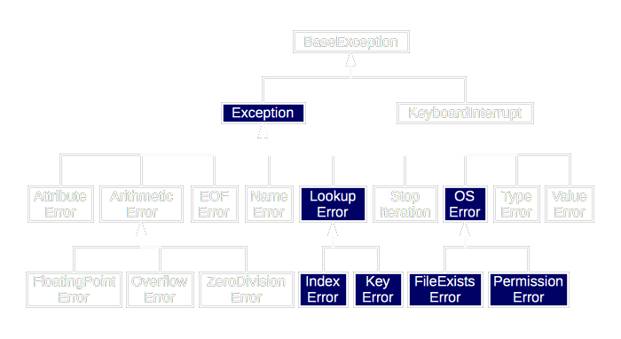

# Exception Handling


- ## Try 
  - ### Each try block should have one or more than one except block 
- ## Except
  - ### One try can have multiple exceptions but one except cannot have multiple try
- ## Else
  - ### This block is accessed if the exception doesn't occur
- ## Finally
  - ### This is the block which ultimately works the least
- ## Raise
  - ### This is used to define Custom Exceptions, except blocks should be there to the corresponding raise block

---


```python
try:
    print(10/0)
except ArithmeticError as e:
    print("Exception Occur", e)
else:
    print("No exception occur")
finally:
    print("In the Finally Block")
print("Rest of the block")

try:
    print("In the Try Block")
except BaseException as e:
    print("Catching the Exception")
else:
    print("No Exception Occurs")
finally:
    print("In the Second Finally Block")
print("After the second block")
```
```commandline
Exception Occur division by zero
In the Finally Block
Rest of the block
In the Try Block
No Exception Occurs
In the Second Finally Block
After the second block

Process finished with exit code 0
```
### Default Exception Should always be in the last except or else it will not work
### Default Exception doesn't show the type of exception occuring thats why one may use BaseException Class
```python
try:
    print(10 / 0)

except TypeError as e:
    print("Exception Occur", e)
except: ## Default Exception
    print("It will not run")
else:
    print("No exception occur")
finally:
    print("In the Finally Block")
print("Rest of the block")

```
```commandline
It will not run
In the Finally Block
Rest of the block

Process finished with exit code 0
```
### We can Handle Multiple Exception in one Except Block
```python
try:
    print(10 / 0)
    print(15+ "k")
except (TypeError, ArithmeticError) as e:
    print("Exception Occur", e)
except:
    print("It will not run")
else:
    print("No exception occur")
finally:
    print("In the Finally Block")
print("Rest of the block")

```
```commandline
Exception Occur division by zero
In the Finally Block
Rest of the block

Process finished with exit code 0

```
### Finally block, no matter what will be executed

### Finally block is used in the cases where the application wants to run some specific functionaltity irrespective of the exception

```python
try:
    print("Hello")
finally:
    print("In the Finally Block")
print("Rest of the block")

```
```commandline
Hello
In the Finally Block
Rest of the block

Process finished with exit code 0

```

```python
try:
    print("Hello")
    print(10 / 0)
finally:
    print("In the Finally Block")
print("Rest of the block")

```
```commandline
Hello
In the Finally Block
Traceback (most recent call last):
  File "D:\Python Training\16 May\Prods\Class Codes\demo.py", line 3, in <module>
    print(10 / 0)
          ~~~^~~
ZeroDivisionError: division by zero

Process finished with exit code 1

```
### Finally doesnot have power to handle the exception only Except can do that, though it still will run and if the error is there the program will end abnormally

```python
try:
    num = int(input("Enter the number: "))
    print(10 / num)
    print(num + "k")
except (TypeError, ArithmeticError) as e:
    print("Exception Occur", e)
except:
    print("It will not run")
else:
    print("No exception occur")
finally:
    print("In the Finally Block")
print("Rest of the block")

```
```commandline
Enter the number: 5
2.0
Exception Occur unsupported operand type(s) for +: 'int' and 'str'
In the Finally Block
Rest of the block

Process finished with exit code 0
```
```commandline
Enter the number: 0
Exception Occur division by zero
In the Finally Block
Rest of the block

Process finished with exit code 0
```
### Finally will only work when the exception occurs in the try block
```python
print(10 / 0) ## Direct Exception
try:
    num = int(input("Enter the number: "))
    print(10 / num)
    print(num + "k")
except (TypeError, ArithmeticError) as e:
    print("Exception Occur", e)
except:
    print("It will not run")
else:
    print("No exception occur")
finally:
    print("In the Finally Block")
print("Rest of the block")

```
```commandline
Traceback (most recent call last):
  File "D:\Python Training\16 May\Prods\Class Codes\demo.py", line 1, in <module>
    print(10 / 0)
          ~~~^~~
ZeroDivisionError: division by zero

Process finished with exit code 1

```

### Another Ways where the finally won't work are
#### When os._exit(0)
```python
import os


try:
    num = int(input("Enter the number: "))
    print(num)
    os._exit(0)
except ValueError as e:
    print("Exception Occur", e)
except:
    print("It will not run")
else:
    print("No exception occur")
finally:
    print("In the Finally Block")
print("Rest of the block")

```
```commandline
Enter the number: 0
0

Process finished with exit code 0
```
#### And using os.abort()

```python
import os


try:
    num = int(input("Enter the number: "))
    print(num)
    os.abort()
except ValueError as e:
    print("Exception Occur", e)
except:
    print("It will not run")
else:
    print("No exception occur")
finally:
    print("In the Finally Block")
print("Rest of the block")

```
```commandline
Enter the number: 0
0


Process finished with exit code -1073740791 (0xC0000409)
```

## User Defined Exceptions
#### To raise your own exception from your own methods you need to use 'raise' keyword `raise ExceptionClassName("Your Information)`. By using `raise` keyword we can raise pre-defined and user-defined exceptions

```python
try:
    raise NameError("Hello")
except NameError as e:
    print("An Exception Occured", e)

```
```commandline
An Exception Occured Hello

Process finished with exit code 0
```
### We can generate exceptions as per our own requirements using raise keyword
```python
try:
    num = int(input("Enter the Number: "))
    if not num % 2 == 0:
        raise NameError("We are against Odd Numbers")
except NameError as e:
    print(e)

```
```commandline
Enter the Number: 3
We are against Odd Numbers

Process finished with exit code 0

```
```commandline
Enter the Number: 2

Process finished with exit code 0

```

### Custom Exceptions using Class
```python
class TooYoungException(Exception):
    def __init__(self, age):
        self.age = age


class TooOldException(Exception):
    def __init__(self, age):
        self.age = age


if __name__ == '__main__':
    age = int(input("Enter your Age: "))
    if age < 18:
        raise TooYoungException("You have to be 18 years old to join")
    elif age > 60:
        raise TooOldException("You are above the age limit")

```
```commandline
Enter your Age: 15
Traceback (most recent call last):
  File "D:\Python Training\16 May\Prods\Class Codes\demo.py", line 13, in <module>
    raise TooYoungException("You have to be 18 years old to join")
TooYoungException: You have to be 18 years old to join

Process finished with exit code 1
```
```commandline
Enter your Age: 90
Traceback (most recent call last):
  File "D:\Python Training\16 May\Prods\Class Codes\demo.py", line 15, in <module>
    raise TooOldException("You are above the age limit")
TooOldException: You are above the age limit

Process finished with exit code 1

```
```commandline
Enter your Age: 19

Process finished with exit code 0

```

## Exception Chaining
```python
def example():
    try:
        int('N/A')
    except ValueError as e:
        raise RuntimeError('A parsing error occurred') from e


if __name__ == '__main__':
    example()

```
```commandline
Traceback (most recent call last):
  File "D:\Python Training\16 May\Prods\Class Codes\demo.py", line 3, in example
    int('N/A')
ValueError: invalid literal for int() with base 10: 'N/A'

The above exception was the direct cause of the following exception:

Traceback (most recent call last):
  File "D:\Python Training\16 May\Prods\Class Codes\demo.py", line 9, in <module>
    example()
  File "D:\Python Training\16 May\Prods\Class Codes\demo.py", line 5, in example
    raise RuntimeError('A parsing error occurred') from e
RuntimeError: A parsing error occurred

Process finished with exit code 1
```
# Python Modules
## Advantages of Python Modules
- **Simplicity**
  - Module often concentrates upon a specific problem in a big project and makes it easy to understand the code as it is segregated as per the use-cases
- **Maintainablity**
  - It makes the code easily accessible and easy to maintain and extend for future additions and updates

## In-Built Python Modules
- Math
- Random
- Os
- sys
- etc
```python
import math
print(math.sqrt(5))
```
```python
from math import sqrt, factorial
print(sqrt(5))
```
```python
import math as m
print(m.sqrt(5))
```
### ⬆ These are the ways to import a module in python

## Example of Modules
```python
# demo_module.py

city_list = ["indore", "delhi"]
```
```python
# demo.py

if __name__ == '__main__':
    from demo_module import city_list
    print(city_list)
```
```commandline
['indore', 'delhi']

Process finished with exit code 0
```


