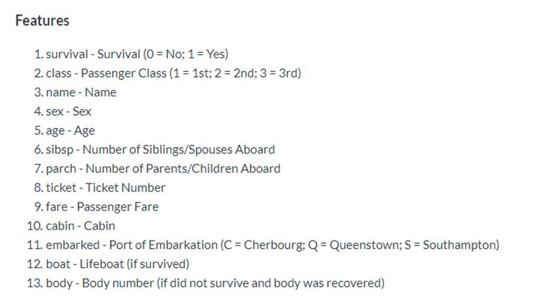

# Project
- Follow Naming Convention
- Create Proper Project Structure
- Follow DRY (Reusable Code)
- To check if there is any null value 
- To check for outliers
- Number of elements 
- Shapes
- Exception Handling with (Custom Exceptions)
- replace null with any value of choice
- Data labeleing
- Data csv encoding check 
- Graph Plotting
- Use Titanic Dataset
- Do exploratory Analysis

## Features of the Dataset Used

pclass,survived,name,sex,age,sibsp,parch,ticket,fare,cabin,embarked,boat,body,home.dest

